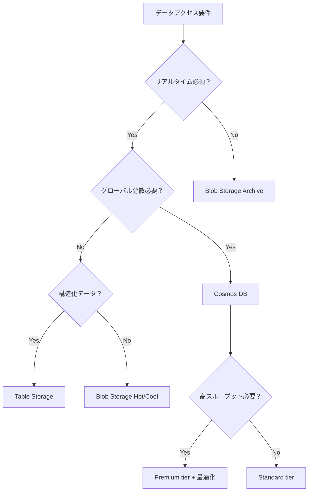

# AZ-204 非リレーショナルデータ用にデータ ストレージ ソリューションを設計する - 学習ガイド

## 📚 目次

1. [概要と学習目標](#概要と学習目標)
2. [Azure Cosmos DB](#azure-cosmos-db)
3. [Azure Blob Storage](#azure-blob-storage)
4. [Azure Table Storage](#azure-table-storage)
5. [Azure Cache for Redis](#azure-cache-for-redis)
6. [設計時の考慮事項](#設計時の考慮事項)
7. [実装例とベストプラクティス](#実装例とベストプラクティス)
8. [監視とトラブルシューティング](#監視とトラブルシューティング)
9. [学習チェックリスト](#学習チェックリスト)
10. [追加リソース](#追加リソース)

---

## 概要と学習目標

### 🎯 学習目標

AZ-204試験において、非リレーショナルデータストレージソリューションの設計に関する以下の知識を習得する：

- **Azure Cosmos DB** のパーティション戦略とパフォーマンス最適化
- **Azure Blob Storage** のアクセス層設計とライフサイクル管理
- **Azure Table Storage** の設計パターンとスケーラビリティ
- **Azure Cache for Redis** の実装パターンと構成
- **コスト最適化** と **パフォーマンス最適化** の戦略

### 📋 試験でカバーされる範囲

| サービス                  | 試験での重要度 | 主要な出題ポイント                           |
| ------------------------- | -------------- | -------------------------------------------- |
| **Azure Cosmos DB**       | ⭐⭐⭐⭐⭐          | パーティション戦略、一貫性レベル、RU最適化   |
| **Azure Blob Storage**    | ⭐⭐⭐⭐           | アクセス層、ライフサイクル管理、セキュリティ |
| **Azure Table Storage**   | ⭐⭐⭐            | パーティション設計、クエリ最適化             |
| **Azure Cache for Redis** | ⭐⭐⭐            | キャッシング戦略、パフォーマンス最適化       |

---

## Azure Cosmos DB

### 🔑 主要概念

**Azure Cosmos DB** は、Microsoft のグローバル分散型マルチモデル データベースサービスです。

#### サポートされるAPI

| API               | 用途                    | データモデル            |
| ----------------- | ----------------------- | ----------------------- |
| **NoSQL API**     | 新規アプリケーション    | JSON ドキュメント       |
| **MongoDB API**   | MongoDB移行             | JSON ドキュメント       |
| **Cassandra API** | Cassandra移行           | ワイドカラム            |
| **Gremlin API**   | グラフデータベース      | グラフ（ノード/エッジ） |
| **Table API**     | Azure Table Storage移行 | キー/値                 |

### 🎯 パーティション戦略

#### パーティションキーの選択基準

**✅ 良いパーティションキーの条件：**

- **高いカーディナリティ** - 多くの異なる値を持つ
- **均等な分散** - データとRUの消費が均等
- **クエリパターンに適合** - よく使用されるフィルター条件
- **変更されない** - 作成後は変更不可
- **サイズ制限** - 通常2048バイト、大きなパーティションキーが有効な場合は101バイト以下

#### パーティション戦略の種類

```markdown
| 戦略                         | 使用場面                                     | メリット                           | デメリット                         |
| ---------------------------- | -------------------------------------------- | ---------------------------------- | ---------------------------------- |
| **通常のパーティションキー** | カーディナリティが高く、クエリパターンに適合 | シンプル、効率的なクエリ           | ホットパーティションのリスク       |
| **合成パーティションキー**   | 単一フィールドでは要件を満たさない場合       | データ分散の改善                   | クロスパーティションクエリの可能性 |
| **階層パーティションキー**   | 大規模データセット、マルチレベルクエリ       | 20GB制限の回避、効率的な階層クエリ | 複雑な管理、計画が必要             |
```

#### 実装例：適切なパーティション戦略

```csharp
// ❌ 悪い例：低いカーディナリティ
{
    "id": "user123",
    "status": "active",  // パーティションキー - 値が少ない
    "name": "John Doe"
}

// ✅ 良い例：高いカーディナリティ
{
    "id": "user123",
    "userId": "user123",  // パーティションキー - ユニーク値
    "status": "active",
    "name": "John Doe"
}

// ✅ 合成パーティションキーの例
{
    "id": "order123",
    "customerId": "cust456",
    "orderDate": "2024-06-15",
    "partitionKey": "cust456_2024-06",  // customerId + 年月
    "amount": 100.00
}
```

### 💰 リクエストユニット（RU）最適化

#### RU消費の要因

- **アイテムサイズ** - 大きなアイテムはより多くのRUを消費
- **インデックス設定** - 不要なインデックスはRUを浪費
- **クエリの複雑さ** - クロスパーティションクエリは高コスト
- **一貫性レベル** - 強い一貫性はRUを多く消費

#### インデックス最適化

```json
{
  "indexingPolicy": {
    "indexingMode": "consistent",
    "automatic": true,
    "includedPaths": [
      {
        "path": "/userId/*"  // よく使用されるプロパティのみインデックス
      },
      {
        "path": "/status/*"
      }
    ],
    "excludedPaths": [
      {
        "path": "/description/*"  // 大きなテキストフィールドを除外
      },
      {
        "path": "/metadata/*"
      }
    ]
  }
}
```

### 🔄 一貫性レベル

| レベル                | 用途               | RU消費       | レプリケーション遅延 |
| --------------------- | ------------------ | ------------ | -------------------- |
| **Strong**            | 重要な金融取引     | 最大（2x）   | なし                 |
| **Bounded Staleness** | リアルタイム分析   | 高           | 設定可能             |
| **Session**           | 一般的なアプリ     | 標準         | セッション内で一貫   |
| **Consistent Prefix** | ソーシャルメディア | 低           | 順序保証             |
| **Eventual**          | ログ、テレメトリ   | 最小（0.5x） | 最大                 |

### 📊 パフォーマンス監視

#### 重要なメトリクス

```csharp
// C# での監視例
var response = await container.ReadItemAsync<MyItem>(id, new PartitionKey(partitionKey));

// RU消費量の確認
double requestCharge = response.RequestCharge;
Console.WriteLine($"RU consumed: {requestCharge}");

// レスポンス時間の監視
var stopwatch = Stopwatch.StartNew();
var result = await container.ReadItemAsync<MyItem>(id, new PartitionKey(partitionKey));
stopwatch.Stop();
Console.WriteLine($"Response time: {stopwatch.ElapsedMilliseconds}ms");
```

---

## Azure Blob Storage

### 🎯 Blob Storage の基本

**Azure Blob Storage** は、大量の非構造化データを格納するためのオブジェクトストレージサービスです。

#### Blobの種類

| 種類            | 用途             | 最大サイズ | 特徴             |
| --------------- | ---------------- | ---------- | ---------------- |
| **Block Blob**  | 一般的なファイル | 190.7 TB   | 最も汎用的       |
| **Append Blob** | ログファイル     | 195 GB     | 追記専用         |
| **Page Blob**   | VHDファイル      | 8 TB       | ランダムアクセス |

### 🌡️ アクセス層設計

#### アクセス層の特徴

| 層          | 用途         | ストレージコスト | アクセスコスト | 最小保持期間 | 可用性 |
| ----------- | ------------ | ---------------- | -------------- | ------------ | ------ |
| **Hot**     | 頻繁アクセス | 高               | 低             | なし         | 99.9%  |
| **Cool**    | 月1回程度    | 中               | 中             | 30日         | 99%    |
| **Cold**    | 数ヶ月に1回  | 低               | 高             | 90日         | 99%    |
| **Archive** | 年1回程度    | 最低             | 最高           | 180日        | 99%    |

#### ライフサイクル管理ポリシー

```json
{
  "rules": [
    {
      "name": "moveToCool",
      "enabled": true,
      "type": "Lifecycle",
      "definition": {
        "filters": {
          "blobTypes": ["blockBlob"],
          "prefixMatch": ["logs/"]
        },
        "actions": {
          "baseBlob": {
            "tierToCool": {
              "daysAfterModificationGreaterThan": 30
            },
            "tierToCold": {
              "daysAfterModificationGreaterThan": 90
            },
            "tierToArchive": {
              "daysAfterModificationGreaterThan": 365
            },
            "delete": {
              "daysAfterModificationGreaterThan": 2555  // 7年後
            }
          }
        }
      }
    }
  ]
}
```

### 🔒 セキュリティとアクセス制御

#### Shared Access Signature (SAS) の実装

```csharp
// User Delegation SAS の作成
public async Task<string> CreateUserDelegationSas(
    BlobContainerClient containerClient,
    string blobName)
{
    // ユーザー委任キーの取得
    var credential = new DefaultAzureCredential();
    var blobServiceClient = containerClient.GetParentBlobServiceClient();
    
    var userDelegationKey = await blobServiceClient.GetUserDelegationKeyAsync(
        DateTimeOffset.UtcNow,
        DateTimeOffset.UtcNow.AddHours(1));

    // SAS の設定
    var sasBuilder = new BlobSasBuilder
    {
        BlobContainerName = containerClient.Name,
        BlobName = blobName,
        Resource = "b", // blob
        ExpiresOn = DateTimeOffset.UtcNow.AddHours(1)
    };
    
    sasBuilder.SetPermissions(BlobSasPermissions.Read);
    
    return sasBuilder.ToSasQueryParameters(
        userDelegationKey.Value, 
        blobServiceClient.AccountName).ToString();
}
```

### 📱 イベント処理

#### Blob Storage イベントの処理

```csharp
// Event Grid を使用したイベント処理
[FunctionName("BlobTrigger")]
public static async Task ProcessBlobEvent(
    [EventGridTrigger] EventGridEvent eventGridEvent,
    ILogger log)
{
    if (eventGridEvent.EventType == "Microsoft.Storage.BlobCreated")
    {
        var blobUrl = eventGridEvent.Subject;
        log.LogInformation($"New blob created: {blobUrl}");
        
        // メタデータ付きでインデックス処理
        var blobClient = new BlobClient(new Uri(blobUrl));
        var metadata = new Dictionary<string, string>
        {
            ["ProcessedAt"] = DateTime.UtcNow.ToString(),
            ["ProcessedBy"] = "BlobProcessor"
        };
        
        await blobClient.SetMetadataAsync(metadata);
    }
}
```

---

## Azure Table Storage

### 🎯 Table Storage の基本

**Azure Table Storage** は、構造化された NoSQL データ用のキー/値ストレージサービスです。

#### Table Storage vs Cosmos DB Table API

| 機能               | Table Storage    | Cosmos DB Table API |
| ------------------ | ---------------- | ------------------- |
| **レイテンシ**     | 高速（上限なし） | 1桁ミリ秒（保証）   |
| **スループット**   | 20,000 ops/sec   | 無制限              |
| **グローバル分散** | 単一リージョン   | マルチリージョン    |
| **インデックス**   | PK/RK のみ       | 自動インデックス    |
| **SLA**            | 99.99%           | 99.999%             |
| **価格**           | 従量課金         | 従量 + プロビジョン |

### 🎯 パーティション設計

#### 効果的なパーティション戦略

```csharp
// ❌ 悪い例：ホットパーティション
public class BadUserEntity : ITableEntity
{
    public string PartitionKey { get; set; } = "Users";  // 全て同じパーティション
    public string RowKey { get; set; }  // UserId
    public string Name { get; set; }
    public DateTimeOffset? Timestamp { get; set; }
    public ETag ETag { get; set; }
}

// ✅ 良い例：分散されたパーティション
public class GoodUserEntity : ITableEntity
{
    public string PartitionKey { get; set; }  // UserId の最初の2文字
    public string RowKey { get; set; }        // UserId
    public string Name { get; set; }
    public DateTimeOffset? Timestamp { get; set; }
    public ETag ETag { get; set; }
}

// 実装例
public string GetPartitionKey(string userId)
{
    // ユーザーIDの最初の2文字を使用してパーティションを分散
    return userId.Length >= 2 ? userId.Substring(0, 2) : userId;
}
```

#### 時系列データの設計パターン

```csharp
// 時系列データのパーティション設計
public class LogEntity : ITableEntity
{
    public string PartitionKey { get; set; }  // 年月 (YYYY-MM)
    public string RowKey { get; set; }        // Ticks（降順） + UniqueId
    public string Level { get; set; }
    public string Message { get; set; }
    public DateTimeOffset? Timestamp { get; set; }
    public ETag ETag { get; set; }
}

// 降順ソートのためのRowKey生成
public static string CreateRowKey(DateTime timestamp, string uniqueId)
{
    var invertedTicks = DateTime.MaxValue.Ticks - timestamp.Ticks;
    return $"{invertedTicks:D19}_{uniqueId}";
}
```

### 🔍 クエリ最適化

#### 効率的なクエリパターン

```csharp
// Point Query（最も効率的）
var entity = await tableClient.GetEntityAsync<UserEntity>(
    partitionKey: "ab",
    rowKey: "user_12345");

// Range Query（パーティション内）
var query = tableClient.QueryAsync<LogEntity>(
    filter: $"PartitionKey eq '2024-06' and RowKey ge '{startRowKey}' and RowKey le '{endRowKey}'",
    maxPerPage: 100);

// Projection Query（必要なプロパティのみ）
var projectionQuery = tableClient.QueryAsync<UserEntity>(
    select: new[] { "Name", "Email" },
    filter: $"PartitionKey eq 'ab'");
```

---

## Azure Cache for Redis

### 🎯 Redis の基本概念

**Azure Cache for Redis** は、高性能なインメモリキャッシュサービスです。

#### サービス層の比較

| 層                   | メモリ        | パフォーマンス  | 用途             | SLA    |
| -------------------- | ------------- | --------------- | ---------------- | ------ |
| **Basic**            | 250MB - 53GB  | 標準            | 開発/テスト      | なし   |
| **Standard**         | 250MB - 53GB  | 標準            | 本番（基本）     | 99.9%  |
| **Premium**          | 6GB - 1.2TB   | 高性能          | 本番（高性能）   | 99.9%  |
| **Enterprise**       | 1GB - 2TB     | 最高性能        | エンタープライズ | 99.95% |
| **Enterprise Flash** | 300GB - 4.5TB | 高性能/低コスト | 大容量           | 99.95% |

### 🎯 キャッシング戦略

#### キャッシングパターン

```csharp
// Cache-Aside パターン
public async Task<User> GetUserAsync(string userId)
{
    var cacheKey = $"user:{userId}";
    
    // キャッシュから取得試行
    var cachedUser = await cache.GetStringAsync(cacheKey);
    if (cachedUser != null)
    {
        return JsonSerializer.Deserialize<User>(cachedUser);
    }
    
    // キャッシュにない場合はデータベースから取得
    var user = await userRepository.GetByIdAsync(userId);
    if (user != null)
    {
        // キャッシュに保存（TTL: 1時間）
        await cache.SetStringAsync(
            cacheKey,
            JsonSerializer.Serialize(user),
            TimeSpan.FromHours(1));
    }
    
    return user;
}

// Write-Through パターン
public async Task UpdateUserAsync(User user)
{
    // データベースを更新
    await userRepository.UpdateAsync(user);
    
    // キャッシュも同時に更新
    var cacheKey = $"user:{user.Id}";
    await cache.SetStringAsync(
        cacheKey,
        JsonSerializer.Serialize(user),
        TimeSpan.FromHours(1));
}

// Write-Behind パターン（バックグラウンド更新）
public async Task UpdateUserWithWriteBehind(User user)
{
    var cacheKey = $"user:{user.Id}";
    
    // キャッシュを即座に更新
    await cache.SetStringAsync(
        cacheKey,
        JsonSerializer.Serialize(user),
        TimeSpan.FromHours(1));
    
    // バックグラウンドでデータベース更新をキューに追加
    await backgroundTaskQueue.QueueBackgroundWorkItem(async token =>
    {
        await userRepository.UpdateAsync(user);
    });
}
```

### 🔧 高度な機能

#### Redis Modules (Enterprise層)

```csharp
// RedisJSON の使用例
public async Task<bool> UpdateUserProfileAsync(string userId, object profileData)
{
    var database = connectionMultiplexer.GetDatabase();
    var key = $"user_profile:{userId}";
    
    // JSON オブジェクトの一部を更新
    var result = await database.ExecuteAsync(
        "JSON.SET",
        key,
        "$.profile",
        JsonSerializer.Serialize(profileData));
        
    return result.ToString() == "OK";
}

// RediSearch の使用例
public async Task<IEnumerable<string>> SearchUsersAsync(string searchTerm)
{
    var database = connectionMultiplexer.GetDatabase();
    
    var result = await database.ExecuteAsync(
        "FT.SEARCH",
        "user_index",
        $"@name:{searchTerm}*",
        "LIMIT", "0", "10");
        
    return ParseSearchResults(result);
}
```

---

## 設計時の考慮事項

### 🎯 パフォーマンス最適化

#### データアクセスパターンの分析

```markdown
## アクセスパターン分析チェックリスト

### 読み取りパターン
- [ ] 読み取り頻度（秒/分/時間/日単位）
- [ ] 読み取りサイズ（KB/MB/GB）
- [ ] クエリの複雑さ（Point/Range/Full scan）
- [ ] 地理的分散要件

### 書き込みパターン
- [ ] 書き込み頻度とバッチサイズ
- [ ] トランザクション要件
- [ ] データの整合性要件
- [ ] 書き込み遅延許容度

### データ特性
- [ ] データサイズの成長率
- [ ] データの関連性
- [ ] 削除/アーカイブポリシー
- [ ] セキュリティ要件
```

### 💰 コスト最適化

#### サービス選択の決定フローチャート



#### リザーブドキャパシティ

```csharp
// コスト削減のためのリザーブドキャパシティ計算
public class ReservedCapacityCalculator
{
    public decimal CalculateSavings(
        int throughputRU,
        int months,
        Region region)
    {
        var payAsYouGoMonthlyCost = throughputRU * 0.008m * 24 * 30; // $0.008/RU/hour
        var reservedMonthlyCost = payAsYouGoMonthlyCost * 0.8m; // 20% 割引
        
        return (payAsYouGoMonthlyCost - reservedMonthlyCost) * months;
    }
}
```

### 🔐 セキュリティ考慮事項

#### 包括的なセキュリティ実装

```csharp
// Azure Key Vault との統合
public class SecureDataService
{
    private readonly SecretClient secretClient;
    private readonly BlobServiceClient blobClient;
    
    public SecureDataService(SecretClient secretClient)
    {
        this.secretClient = secretClient;
        
        // マネージドIDを使用した認証
        var credential = new DefaultAzureCredential();
        this.blobClient = new BlobServiceClient(
            new Uri("https://mystorageaccount.blob.core.windows.net"),
            credential);
    }
    
    public async Task<string> EncryptAndStoreAsync(string data, string keyName)
    {
        // Key Vault から暗号化キーを取得
        var keySecret = await secretClient.GetSecretAsync(keyName);
        
        // データを暗号化
        var encryptedData = EncryptData(data, keySecret.Value.Value);
        
        // Blob Storage に保存
        var blobName = Guid.NewGuid().ToString();
        var blobClient = this.blobClient.GetBlobContainerClient("secure-data")
                                      .GetBlobClient(blobName);
        
        await blobClient.UploadAsync(
            BinaryData.FromString(encryptedData),
            new BlobUploadOptions
            {
                Metadata = new Dictionary<string, string>
                {
                    ["EncryptedWith"] = keyName,
                    ["EncryptedAt"] = DateTime.UtcNow.ToString("O")
                }
            });
            
        return blobName;
    }
}
```

---

## 実装例とベストプラクティス

### 🚀 実装パターン

#### マルチサービス統合パターン

```csharp
// 複数のストレージサービスを統合したアーキテクチャ
public class HybridDataService
{
    private readonly CosmosClient cosmosClient;
    private readonly BlobServiceClient blobClient;
    private readonly TableServiceClient tableClient;
    private readonly IDistributedCache redisCache;
    
    public async Task<UserProfile> GetUserProfileAsync(string userId)
    {
        // 1. Redis キャッシュから確認
        var cachedProfile = await GetFromCacheAsync(userId);
        if (cachedProfile != null) return cachedProfile;
        
        // 2. Cosmos DB からメタデータ取得
        var userMetadata = await GetUserMetadataAsync(userId);
        if (userMetadata == null) return null;
        
        // 3. Blob Storage から大きなデータ（画像等）を取得
        var profileImage = await GetProfileImageAsync(userMetadata.ProfileImageId);
        
        // 4. Table Storage からアクティビティログ取得
        var recentActivity = await GetRecentActivityAsync(userId);
        
        // 5. 結果を組み合わせてキャッシュに保存
        var profile = new UserProfile
        {
            Metadata = userMetadata,
            ProfileImage = profileImage,
            RecentActivity = recentActivity
        };
        
        await SetCacheAsync(userId, profile, TimeSpan.FromMinutes(15));
        return profile;
    }
    
    private async Task<UserProfile> GetFromCacheAsync(string userId)
    {
        var cacheKey = $"profile:{userId}";
        var cached = await redisCache.GetStringAsync(cacheKey);
        return cached != null ? JsonSerializer.Deserialize<UserProfile>(cached) : null;
    }
}
```

#### バッチ処理パターン

```csharp
// 大量データ処理のためのバッチパターン
public class BatchProcessor
{
    private readonly CosmosClient cosmosClient;
    private readonly Container container;
    
    public async Task ProcessLargeDatasetAsync(IEnumerable<DataItem> items)
    {
        const int batchSize = 100;
        var batches = items.Chunk(batchSize);
        
        await Parallel.ForEachAsync(batches, 
            new ParallelOptions { MaxDegreeOfParallelism = 10 },
            async (batch, ct) =>
            {
                // TransactionalBatch を使用した効率的な書き込み
                var partitionKeyGroups = batch.GroupBy(item => item.PartitionKey);
                
                foreach (var group in partitionKeyGroups)
                {
                    var transactionBatch = container.CreateTransactionalBatch(
                        new PartitionKey(group.Key));
                    
                    foreach (var item in group)
                    {
                        transactionBatch.CreateItem(item);
                    }
                    
                    var response = await transactionBatch.ExecuteAsync(ct);
                    if (!response.IsSuccessStatusCode)
                    {
                        // エラーハンドリング
                        await HandleBatchErrorAsync(group, response);
                    }
                }
            });
    }
}
```

### 📊 監視とアラート

#### 包括的な監視実装

```csharp
// Application Insights と組み合わせた監視
public class MonitoredDataService
{
    private readonly TelemetryClient telemetryClient;
    private readonly CosmosClient cosmosClient;
    
    public async Task<T> GetItemWithMonitoringAsync<T>(string id, string partitionKey)
    {
        var stopwatch = Stopwatch.StartNew();
        var operationId = Guid.NewGuid().ToString();
        
        try
        {
            telemetryClient.TrackEvent("CosmosDB.Query.Started", new Dictionary<string, string>
            {
                ["OperationId"] = operationId,
                ["ItemId"] = id,
                ["PartitionKey"] = partitionKey
            });
            
            var response = await container.ReadItemAsync<T>(id, new PartitionKey(partitionKey));
            
            // パフォーマンスメトリクスの記録
            telemetryClient.TrackMetric("CosmosDB.RU.Consumed", response.RequestCharge);
            telemetryClient.TrackMetric("CosmosDB.Latency.Ms", stopwatch.ElapsedMilliseconds);
            
            return response.Resource;
        }
        catch (CosmosException ex)
        {
            // エラーの詳細な記録
            telemetryClient.TrackException(ex, new Dictionary<string, string>
            {
                ["OperationId"] = operationId,
                ["StatusCode"] = ex.StatusCode.ToString(),
                ["SubStatusCode"] = ex.SubStatusCode?.ToString(),
                ["RequestCharge"] = ex.RequestCharge?.ToString()
            });
            
            throw;
        }
        finally
        {
            stopwatch.Stop();
            telemetryClient.TrackEvent("CosmosDB.Query.Completed", new Dictionary<string, string>
            {
                ["OperationId"] = operationId,
                ["Duration"] = stopwatch.ElapsedMilliseconds.ToString()
            });
        }
    }
}
```

---

## 監視とトラブルシューティング

### 📊 重要なメトリクス

#### Cosmos DB 監視メトリクス

| メトリクス         | 閾値         | アクション               |
| ------------------ | ------------ | ------------------------ |
| **RU消費率**       | > 80%        | スループット増加検討     |
| **スロットリング** | > 1%         | パーティションキー見直し |
| **レイテンシ**     | > 10ms (P99) | インデックス最適化       |
| **可用性**         | < 99.99%     | マルチリージョン設定     |

#### Blob Storage 監視メトリクス

| メトリクス           | 閾値     | アクション         |
| -------------------- | -------- | ------------------ |
| **可用性**           | < 99.9%  | 冗長性設定確認     |
| **E2E遅延**          | > 1000ms | ネットワーク最適化 |
| **容量**             | > 80%    | ライフサイクル管理 |
| **トランザクション** | 高頻度   | アクセス層見直し   |

### 🔧 一般的な問題と解決策

#### Cosmos DB のトラブルシューティング

```csharp
// ホットパーティション検出と対策
public class PartitionAnalyzer
{
    public async Task AnalyzePartitionUsageAsync(Container container)
    {
        var query = new QueryDefinition(
            "SELECT c.partitionKey, COUNT(1) as itemCount " +
            "FROM c GROUP BY c.partitionKey");
            
        var partitionCounts = new Dictionary<string, int>();
        
        using var iterator = container.GetItemQueryIterator<dynamic>(query);
        while (iterator.HasMoreResults)
        {
            var response = await iterator.ReadNextAsync();
            foreach (var item in response)
            {
                partitionCounts[item.partitionKey] = item.itemCount;
            }
        }
        
        // ホットパーティションの検出
        var average = partitionCounts.Values.Average();
        var hotPartitions = partitionCounts
            .Where(kvp => kvp.Value > average * 2)  // 平均の2倍以上
            .OrderByDescending(kvp => kvp.Value)
            .Take(5);
            
        if (hotPartitions.Any())
        {
            Console.WriteLine("Hot partitions detected:");
            foreach (var partition in hotPartitions)
            {
                Console.WriteLine($"Partition: {partition.Key}, Count: {partition.Value}");
            }
        }
    }
}
```

#### Redis キャッシュの最適化

```csharp
// Redis パフォーマンス最適化
public class RedisOptimizer
{
    private readonly IConnectionMultiplexer redis;
    
    public async Task OptimizeKeyspacesAsync()
    {
        var database = redis.GetDatabase();
        var server = redis.GetServer(redis.GetEndPoints().First());
        
        // メモリ使用量の分析
        var info = await server.InfoAsync("memory");
        var usedMemory = info.First(x => x.Key == "used_memory").Value;
        
        // 期限切れキーの削除
        await server.ExecuteAsync("EXPIRE", "*temp*", "3600");
        
        // 大きなキーの検出
        var largeKeys = new List<string>();
        await foreach (var key in server.ScanAsync(pattern: "*"))
        {
            var size = await database.ExecuteAsync("MEMORY", "USAGE", key);
            if ((long)size > 1024 * 1024) // 1MB以上
            {
                largeKeys.Add(key);
            }
        }
        
        Console.WriteLine($"Large keys found: {string.Join(", ", largeKeys)}");
    }
}
```

---

## 学習チェックリスト

### ✅ 基礎知識

- [ ] 各ストレージサービスの特徴と用途を理解
- [ ] パーティション戦略の基本概念を把握
- [ ] アクセス層とライフサイクル管理を理解
- [ ] キャッシング戦略の基本パターンを把握

### ✅ 実装スキル

- [ ] Cosmos DB のパーティションキー設計ができる
- [ ] Blob Storage のライフサイクルポリシーを作成できる
- [ ] Table Storage の効率的なクエリを書ける
- [ ] Redis のキャッシュパターンを実装できる

### ✅ 運用・監視

- [ ] 各サービスの重要メトリクスを特定できる
- [ ] パフォーマンス問題の診断ができる
- [ ] コスト最適化の戦略を立てられる
- [ ] セキュリティ要件を満たす設計ができる

### ✅ 試験対策

- [ ] サービス間の比較表を暗記
- [ ] 制限値と閾値を覚える
- [ ] 一般的なエラーと対処法を理解
- [ ] ベストプラクティスを整理

---

## 追加リソース

### 📚 公式ドキュメント

- [Azure Cosmos DB ドキュメント](https://docs.microsoft.com/azure/cosmos-db/)
- [Azure Blob Storage ドキュメント](https://docs.microsoft.com/azure/storage/blobs/)
- [Azure Table Storage ドキュメント](https://docs.microsoft.com/azure/storage/tables/)
- [Azure Cache for Redis ドキュメント](https://docs.microsoft.com/azure/azure-cache-for-redis/)

### 🎓 学習パス

- [AZ-204: Azure 開発者向けソリューションの開発](https://docs.microsoft.com/learn/certifications/azure-developer/)
- [Azure Cosmos DB 開発者](https://docs.microsoft.com/learn/paths/azure-cosmos-db-developer/)
- [Azure Storage の実装](https://docs.microsoft.com/learn/paths/implement-azure-storage/)

### 🔧 ツール

- [Azure Storage Explorer](https://azure.microsoft.com/features/storage-explorer/)
- [Cosmos DB Data Explorer](https://cosmos.azure.com/)
- [Azure Pricing Calculator](https://azure.microsoft.com/pricing/calculator/)
- [Redis CLI](https://redis.io/topics/rediscli)

### 📖 推奨書籍

- "Designing Distributed Systems" by Brendan Burns
- "Azure Architecture Explained" by David Rendón
- "Redis in Action" by Josiah Carlson

---

## 重要な数値・制限値 📊

| サービス          | 項目                     | 制限値     |
| ----------------- | ------------------------ | ---------- |
| **Cosmos DB**     | RU/秒 (最小)             | 400        |
| **Cosmos DB**     | パーティション最大サイズ | 20 GB      |
| **Cosmos DB**     | パーティションキーサイズ | 2048 bytes |
| **Blob Storage**  | ブロックBlobサイズ       | 190.7 TB   |
| **Blob Storage**  | アーカイブ取得時間       | 1-15時間   |
| **Table Storage** | エンティティサイズ       | 1 MB       |
| **Table Storage** | プロパティ数             | 252        |
| **Redis**         | データベース数           | 16         |
| **Redis**         | キーサイズ               | 512 MB     |

---

**最終更新**: 2024年6月15日  
**対象試験**: AZ-204 Developing Solutions for Microsoft Azure

> 💡 **学習のヒント**: このガイドを使用して体系的に学習し、実際のプロジェクトで各サービスを試して理解を深めてください。試験では実践的な知識が重要です。
